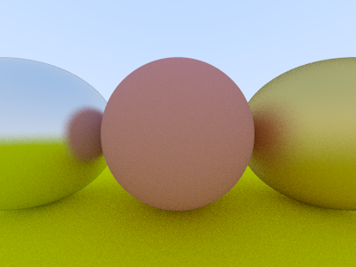

# Pascal - Raytracing In One Weekend

This is a fairly straightforward implementation of [Peter Shirley's "Ray Tracing in One Weekend"](https://raytracing.github.io/books/RayTracingInOneWeekend.html) book in Object Pascal Delphi and FPC/Lazarus.

**Technical TODOs:**
- [x] JSON scene loader in Windows
- [x] JSON scene loader in Linux
- [x] PPM image exporter in Windows
- [x] PPM image exporter in Linux
- [x] BMP image exporter in Windows
- [x] BMP image exporter in Linux
- [ ] Clean the code

**Business TODOs:**
- [x] The vec3 Class
- [x] Rays, a Simple Camera, and Background
- [x] Adding a Sphere
- [x] Surface Normals and Multiple Objects
- [x] Antialiasing
- [x] Diffuse Materials
- [x] Metal
- [ ] Dielectrics
- [ ] Positionable Camera
- [ ] Defocus Blur
- [ ] Where Next?

**Project TODOs:**
- [ ] Nothing more to do, project concluded.
