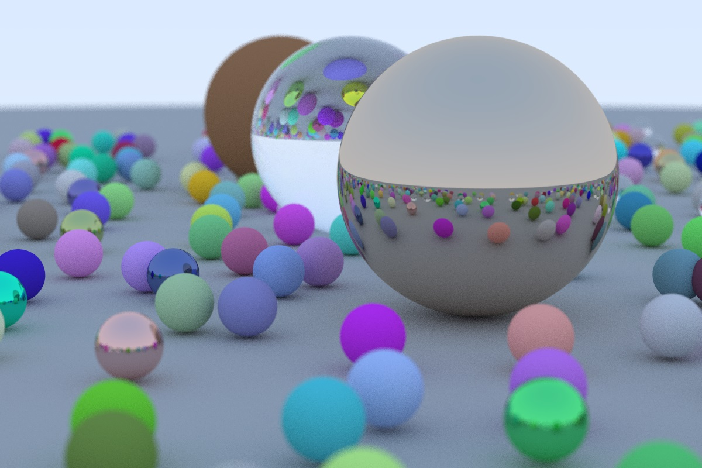

# Pascal - Raytracing In One Weekend

This is a fairly straightforward implementation of [Peter Shirley's "Ray Tracing in One Weekend"](https://raytracing.github.io/books/RayTracingInOneWeekend.html) book in Object Pascal Delphi and FPC/Lazarus.

Book cover rendered with 3000 x 2000 pixels, 1000 samples per pixel and 500 of max ray depth. Took approximately 41 hours to render with Delphi-Windows build.
